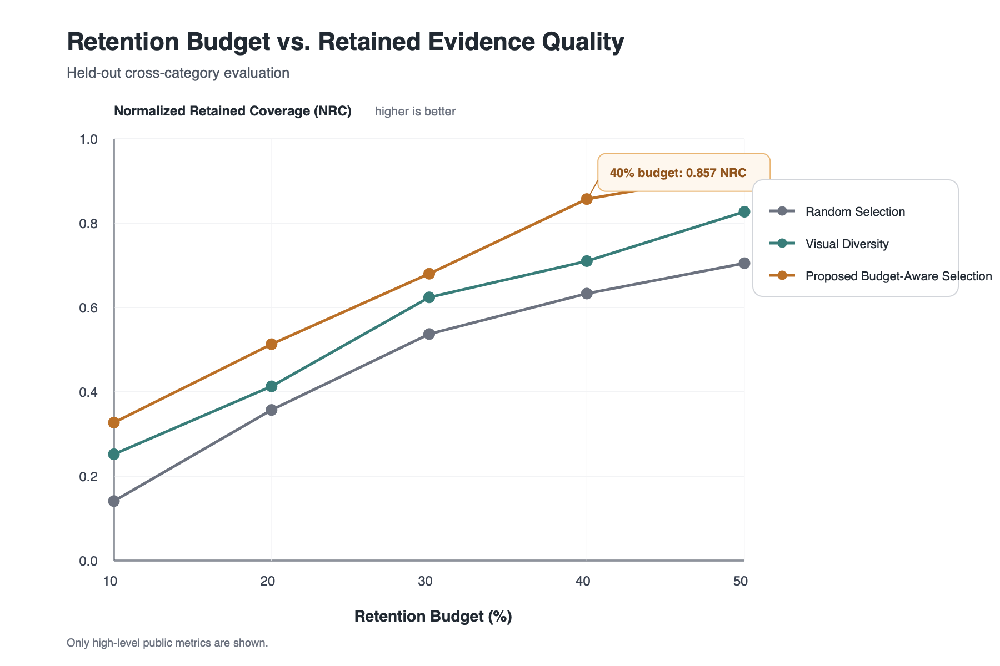
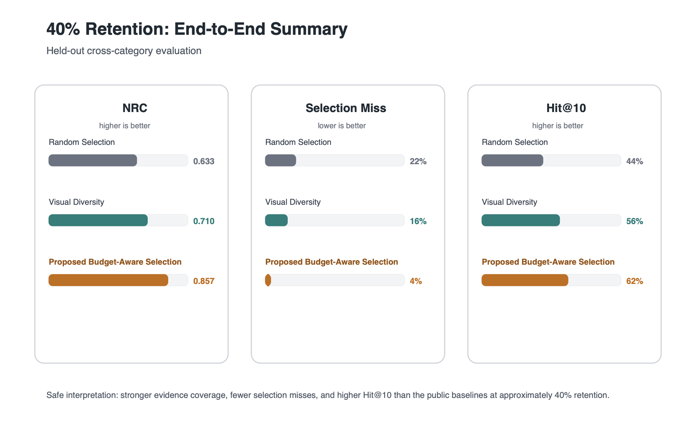

# Efficient Video AI Retrieval Pipeline

> Public portfolio version of an ongoing master's thesis research project.


This project investigates efficient long-term video understanding under limited storage and computation. Instead of retaining and repeatedly processing all continuous surveillance video, the system selects useful video evidence before future user queries are known, then performs multimodal semantic understanding and retrieval after a query arrives. YOLOv8 and ByteTrack serve as lightweight front-end components within a broader Video AI retrieval pipeline.

## Motivation & Research Question

Continuous surveillance systems generate large volumes of redundant video. Keeping and processing everything indefinitely is expensive in both storage and computation.

The central research question is:

> Before future queries are known, which video evidence should be retained under a limited budget so that useful information remains available for later semantic retrieval?

This motivates a two-stage system design: **Stage 1 - Pre-query Selection**, where incoming video is analyzed and selected before query intent is known, and **Stage 2 - Query-time Retrieval**, where retained evidence is interpreted and retrieved after a user query arrives.

## Project Goal

The goal is not simply object detection or tracking. The goal is to build and evaluate an end-to-end Video AI pipeline that:

- Processes continuous video using lightweight visual analysis
- Represents candidate video evidence for machine-learning workflows
- Performs learned budget-aware selection before future queries are known
- Retains a compact subset of useful evidence
- Performs VLM-based understanding and semantic retrieval after queries arrive
- Evaluates tradeoffs between retention budget, evidence quality, downstream retrieval performance, and processing cost

## System Architecture


**Stage 1 - Pre-query Selection:** lightweight visual analysis and learned budget-aware selection decide what evidence survives under storage and computation constraints.

**Stage 2 - Query-time Retrieval:** after a query arrives, multimodal models interpret and retrieve relevant information from the retained evidence.

## My Work

- Designed and implemented the end-to-end experimental Video AI pipeline.
- Built long-form video preprocessing and candidate-segmentation workflows.
- Integrated YOLOv8 and ByteTrack for lightweight object detection and tracking.
- Designed structured video representations for downstream machine learning.
- Developed and evaluated learned budget-aware video selection.
- Integrated VLM-based semantic understanding and embedding-based retrieval.
- Built evaluation workflows across multiple retention budgets and held-out data.
- Analyzed selection quality, retrieval performance, and resource-quality tradeoffs.

## Experimental Results

The public evaluation below shows a small-scale held-out cross-category evaluation. Only selected high-level results are reported; research-specific objective functions, training targets, feature construction, dataset details, and implementation details are intentionally omitted. These results should be interpreted as preliminary experimental evidence rather than large-scale benchmark results.



In this small-scale held-out evaluation, the proposed approach showed higher retained evidence coverage than the reported public baselines across the shown retention budgets.



At approximately 40% retention, the proposed approach achieved 0.857 normalized retained coverage, reduced selection miss to 4%, and reached 62% Hit@10 in the evaluated sample. Evaluation is currently limited in scale; broader validation is part of ongoing research.

## Public Demo

This repository includes a standalone public-safe YOLOv8 + ByteTrack tracking demo for the lightweight computer-vision front end.

```bash
python demo/run_yolov8_bytetrack.py \
    --source path/to/video.mp4 \
    --output outputs/tracked.mp4
```

See [demo/README.md](demo/README.md) for setup and usage. This demo is not the full research system and does not contain the unpublished budget-aware selection implementation.

## Tech Stack

Python, PyTorch, OpenCV, YOLOv8, ByteTrack, scikit-learn, XGBoost, Vision-Language Models, Embedding Retrieval, Git

## Repository Scope

This repository is a public portfolio version of ongoing research. It includes system-level architecture, selected public-safe experimental results, and a runnable lightweight CV demo.

It intentionally excludes unpublished selection implementation, research-specific formulations, private datasets, and full experimental artifacts.

## Status

**Active / Ongoing**

The thesis research is ongoing. This public repository will be updated with selected non-sensitive demos and engineering components as they become appropriate for public release.
