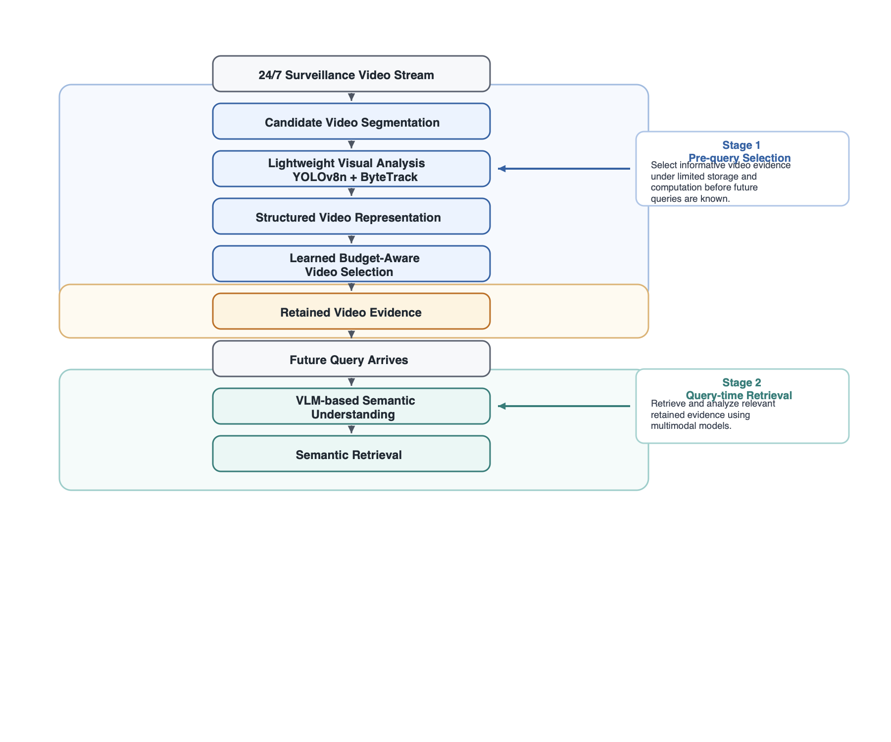

# Efficient Video AI Retrieval Pipeline

> Public portfolio version of an ongoing master's thesis research project.
> Research-specific algorithms, datasets, and experimental details are intentionally omitted.


This repository presents a public portfolio version of an ongoing master's thesis research project on efficient video understanding and retrieval under limited storage and computational resources. It highlights system design, computer-vision engineering, and selected public-safe implementation work.

## Overview

Continuous surveillance video creates large amounts of redundant visual data. This project explores an efficient Video AI pipeline that performs lightweight visual analysis and learned video selection under limited storage and computational resources before future queries are known.

After a query arrives, retained evidence can be processed using multimodal models for semantic understanding and retrieval.

## System Architecture



Stage 1 performs lightweight visual processing and learned budget-aware evidence selection before a future query is known. Stage 2 performs multimodal semantic understanding and retrieval after a query arrives.

## Public Demo

This repository includes a standalone public-safe YOLOv8 + ByteTrack tracking demo representing the lightweight computer-vision front end of the broader system.

```bash
python demo/run_yolov8_bytetrack.py \
    --source path/to/video.mp4 \
    --output outputs/tracked.mp4
```

See [demo/README.md](demo/README.md) for setup and usage. This demo illustrates generic detection and tracking behavior; it is not the complete thesis pipeline and does not implement the research-specific video selection method.

## Pipeline

1. **Video Stream**  
   Continuous surveillance video is treated as a long-form input stream.

2. **Candidate Video Segmentation**  
   Incoming video is divided into manageable candidate segments for downstream processing.

3. **Lightweight Visual Analysis**  
   Public-safe computer vision components such as YOLOv8n and ByteTrack support object detection and multi-object tracking. A runnable generic demo of this stage is included in this repository.

4. **Structured Video Representation**  
   Visual observations are organized into structured representations suitable for machine-learning workflows.

5. **Learned Budget-Aware Video Selection**  
   A learned selection stage retains informative evidence under storage and computation limits before future queries are known.

6. **Retained Video Evidence**  
   Selected evidence forms a compact public-facing abstraction of what remains available for later analysis.

7. **VLM-based Semantic Understanding**  
   When a future query arrives, retained evidence can be interpreted using Vision-Language Models.

8. **Semantic Retrieval**  
   Embedding-based retrieval can support query-time search over retained video evidence.

## What I Built

Overall research system experience:

- Long-form surveillance video preprocessing
- Candidate video generation workflow
- Object detection pipeline experience
- Multi-object tracking workflow experience
- Structured visual representation design
- Supervised machine-learning experimentation
- Budget-aware video selection at a high level
- Multimodal video understanding workflow
- Semantic embedding and retrieval workflow
- End-to-end evaluation workflow design

Publicly included in this repository:

- Generic YOLOv8 video object detection demo
- Generic ByteTrack multi-object tracking demo
- Track ID and class-label visualization
- Annotated video export workflow
- Public architecture and project-scope documentation

## Tech Stack

- Python
- YOLOv8
- ByteTrack
- OpenCV
- PyTorch
- scikit-learn
- XGBoost
- Vision-Language Models (VLM)
- Embedding-based Retrieval
- Git

## Engineering Highlights

- Processing continuous and long-form video
- Detection and tracking pipeline organization
- Structured feature extraction for video AI workflows
- Supervised ML experimentation practices
- Multimodal inference and semantic retrieval concepts
- End-to-end experimental evaluation workflow
- Clear public/private repository boundaries

## Repository Scope

This public repository focuses on system architecture, a runnable public-safe computer-vision demo, and selected engineering documentation. Research-specific algorithms, private datasets, full experiments, and unpublished thesis details remain outside this repository.

Additional technical details can be discussed during interviews where appropriate.

## Status

**Active / Ongoing**

The thesis research is ongoing. This public repository will be updated with selected non-sensitive demos and engineering components as they become appropriate for public release.
